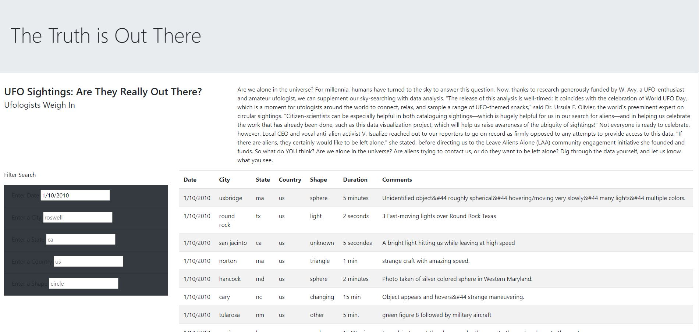
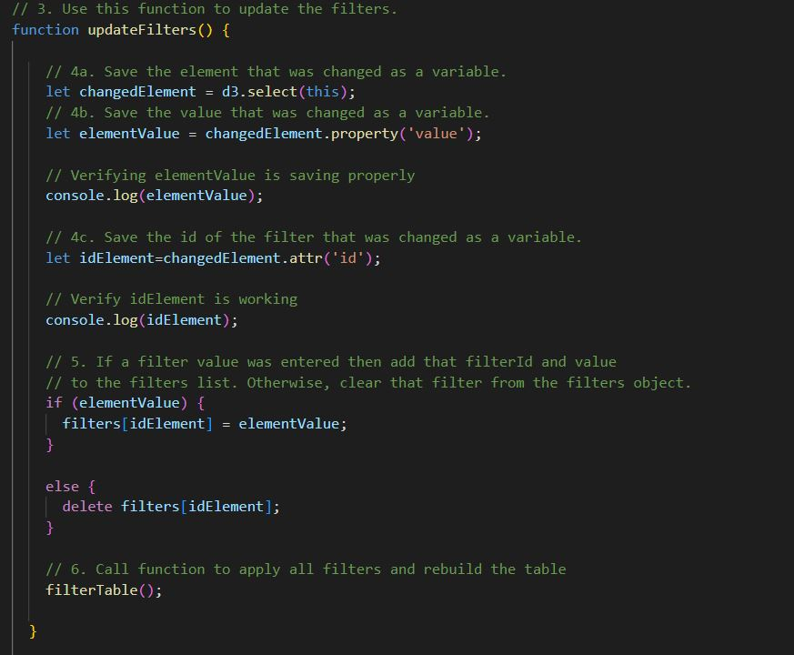

# UFOs

## Overview
* Our goal in this exercise was to create a functional website using JS and HTML to display filterable UFO sighting data. 

## Results
* Below is displayed the final website. Search bars to enter filter criteria are displayed clearly to the left using the date 1/10/2010 as an example criteria. 

* The function used to generate the filtered results is displayed below as example code: 

## Summary
* A major drawback to this project is that the data used for search results measures the duration of the sightings highly inconsistently. Some rows even have logically invalid entries such as 'Downtown' in the 'Duration' column. 

* To improve this dataset significant cleaning should be done to eliminate invalid entries and to normalize all time measurements. Additionally, the 'Comments' column could reasonably be dropped for lack of relevance. 

